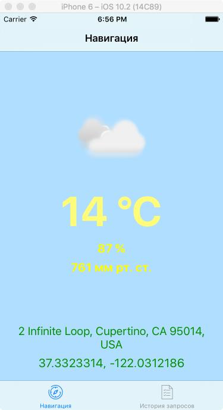

# Requirements Document

# 1 Introduction

The main goal of this project is to develop iOS application, which provides user with such useful information, as latest news, weather forecast and its current location.

# 2 User Requirements
### 2.1 Software Interfaces

Application will be written in Swift in Xcode IDE. It will be using Google API to get user's location, OpenWeatherMap API to get weather forecast and BBC News API to get latest news.

### 2.2 User Interfaces

This project is continuation of the previous one, which main goal was to show user information about his location and weather forecast. So, below you may see the previous project's user interface:

Here you can see mockups of new screens:

This is not the final design. I just tried to create user interface from stock iOS UI-elements.

### 2.3 User Characteristics

The target audience is everyone, who has necessity in latest news and weather forecast and wants to see it in one place.
Users just need to know, how to use their iOS-devices.

### 2.4 Assumptions and Dependencies

To use application user needs Internet connection. Without Internet connection there will be available only history of user requests.

# 3 System Requirements

User has to have any iOS device running iOS 9.3.x and higher.

### 3.1 Functional Requirements

Application must:

1. Show geographic coordinates (latitude, longitude) and address (street, city, country) of the user's current location;
2. Show current weather forecast for the city (uses city, gotten in the article above);
3. Save info from 2 articles above and show it;
4. Show latest news of the city/country (from 1 to 10 news);
5. Give ability to search for weather forecast of other cities;
6. Show weather forecast for 5 days.

### 3.2 Non-Functional Requirements 
#### 3.2.1 SOFTWARE QUALITY ATTRIBUTES

1. Latest news: 
application must show only latest news. Every news will checked: if it's publication date will differ from current date, this news will not be shown in news screen.
