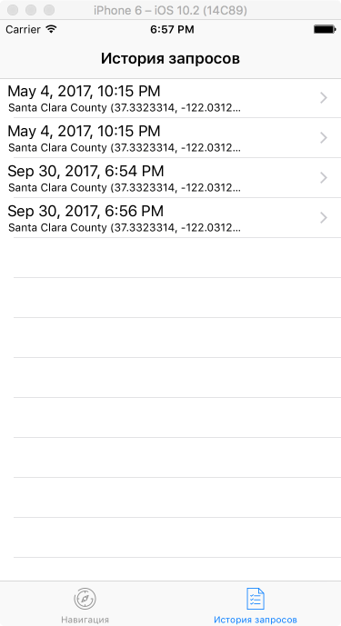
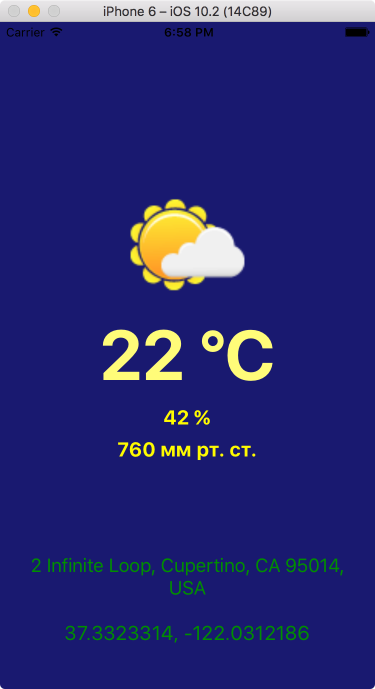

# Требования к проекту

# 1 Введение

Целью разработки является приложение для мобильных устройств под управлением операционной системы iOS, которое предоставляет пользователю доступ к актуальным новостям, погоде и текущему местоположению. 

# 2 Требования пользователя
### 2.1 Программные интерфейсы

Приложение будет написано на языке Swift в Xcode 8 с использованием Google API (для реверс-геокодинга, т.к. нативный геокодинг работает не для всех стран), OpenWeatherMap API (получение данных о погоде) и BBC News API (получение новостей).

### 2.2 Интерфейс пользователя

Данный проект является продолжением уже существующей версии. Ниже представлен интерфейс на данный момент:

Ниже представлены дополнительные экраны приложения:

### 2.3 Характеристика пользователей

Целевая аудитория приложения - любые пользователи, интересующиеся погодой и новостями.
Минимальный необходимый навык - умение использовать устройство под управлением iOS.

### 2.4 Предположения и зависимости

Для использования приложения необходимо соединение с интернетом. В случае его отсутствия будет доступна только история запросов пользователя.

# 3 Системные требования

Любое устройство под управлением iOS 9.3.x и выше.

### 3.1 Функциональные требования

1. Вывод геокоординат (широта, долгота) и адреса (улица, город, страна) места, где находится пользователь;
2. Вывод текущей погоды в соответствии с городом и страной;
3. Сохранение данных из первых двух пунктов и возможность их просмотра;
4. Вывод новостей города и (или) страны в количестве до 10 штук;
5. Возможность поиска погоды других городов (полнота списка городов зависит от OpenWeatherMap API, который предоставляет данные о погоде);
6. Возможность просмотра прогноза погоды (на пять дней вперёд).

### 3.2 Нефункциональные требования
#### 3.2.1 Атрибуты качества

1. Последние новости: 
приложение должно предоставлять доступ только к актуальным новостям. Каждая новость будет проходить проверку на дату публикации. В том случае, если дата публикации новости будет отличаться от текущей даты, то новость не будет доступна для просмотра пользователем;
