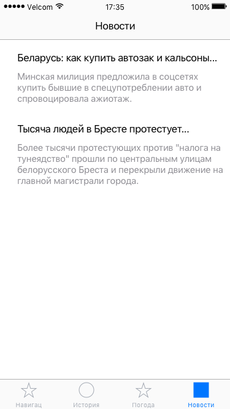

# Требования к проекту

# 1 Введение

Целью разработки является приложение для мобильных устройств под управлением операционной системы iOS, которое предоставляет пользователю доступ к актуальным новостям, курсу валют, погоде и текущему местоположению.

## Аналоги

Главным аналогом является приложение от Google под названием "Google News & Weather". Основным недостатком этого приложения является то, что оно загружает интернет-страницу с новостью (на интернет-странице может присутствовать ненужная для пользователя информация). Также к недостаткам можно отнести отсутствие актуального курса валют.
Добавление выше перечисленного функционала в разрабатываемое приложение позволит ему конкурировать с "Google News & Weather".

# 2 Требования пользователя
### 2.1 Программные интерфейсы

Приложение должно быть написано на языке Swift в Xcode 8 с использованием Google API (для реверс-геокодинга, т.к. нативный геокодинг работает не для всех стран), OpenWeatherMap API (получение данных о погоде) и BBC News API (получение новостей).

### 2.2 Интерфейс пользователя

Данный проект является продолжением уже существующей версии. Ниже представлен интерфейс на данный момент:

Ниже представлены дополнительные экраны приложения:

### 2.3 Характеристика пользователей

Целевая аудитория приложения - любые пользователи, интересующиеся погодой и новостями.
Минимальный необходимый навык - умение использовать устройство под управлением iOS.

### 2.4 Предположения и зависимости

Для использования приложения необходимо соединение с интернетом. В случае его отсутствия будет доступна только история запросов пользователя.

# 3 Системные требования

Любое устройство под управлением iOS 9.3.x и выше.

### 3.1 Функциональные требования:

1. вывод геокоординат (широта, долгота) и адреса (улица, город, страна) места, где находится пользователь;
2. вывод текущей погоды в соответствии с городом и страной;
3. сохранение данных из первых двух пунктов и возможность их просмотра;
4. вывод новостей города и (или) страны в количестве до 10 штук;
5. возможность поиска погоды других городов (полнота списка городов зависит от OpenWeatherMap API, который предоставляет данные о погоде);
6. возможность просмотра прогноза погоды (на пять дней вперёд).

### 3.2 Нефункциональные требования
#### 3.2.1 Атрибуты качества:
1. актуальные данные: даты публикации новостей должна совпадать с текущей датой. Новости, которые не подпадают под этот критерий, не должны быть показаны пользователю. То же самое касается курса валют: при каждом входе в приложение необходимо загружать новые данные о курсе валют;
2. энергоэффективность: геолокация должна быть использована только при запуске приложения. После определения координат пользователя она должна быть немедленно выключена.
#### 3.2.2 Внешние интерфейсы:
1. минимальное поддерживаемое разрешение должно быть 640×960 (т.е. начиная с 3,5-дюймовых моделей iOS-устройств).
#### 3.2.3 Ограничения:
1. приложение должно быть написано на языке Swift версии 3 или выше.
